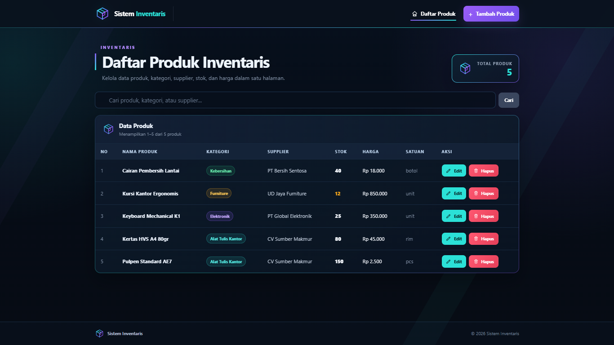
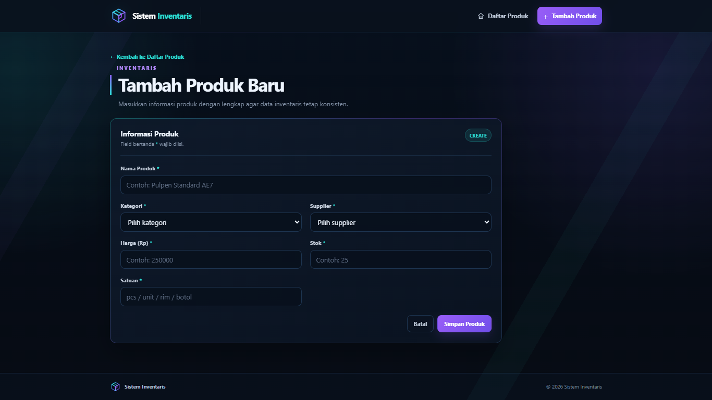
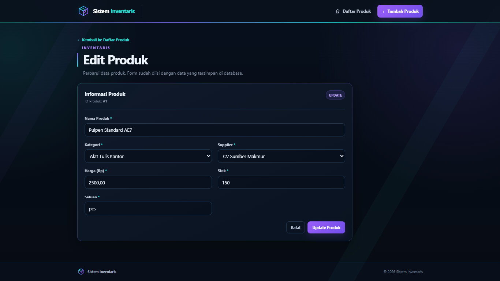

# Sistem Inventaris

Aplikasi CRUD inventaris berbasis PHP Native, MySQL, dan PDO dengan Singleton Pattern. Aplikasi digunakan untuk mengelola data produk beserta kategori dan supplier.

## Teknologi

- PHP Native
- MySQL
- PDO
- HTML5
- CSS3
- XAMPP

## Fitur Wajib

- Database `inventaris_db` dengan 3 tabel utama dan foreign key
- Minimal 5 data seed pada setiap tabel utama
- Koneksi database menggunakan PDO dengan Singleton Pattern
- Daftar produk dengan JOIN kategori dan supplier
- Form tambah produk dengan dropdown kategori dan supplier
- Form edit dengan data yang sudah terisi (pre-filled)
- Hapus produk dengan konfirmasi
- Prepared statements untuk query yang menerima input pengguna
- `htmlspecialchars()` untuk output HTML
- Flash message sukses/gagal dengan pola redirect
- Tampilan responsive dan rapi

## Fitur Bonus

- Pencarian berdasarkan nama produk, kategori, atau supplier
- Pagination
- Transaction saat menghapus produk dengan pencatatan aktivitas pada tabel `log_aktivitas`

## Struktur Project

```text
TugasWeb-Pertemuan8-CRUD/
├── assets/
│   └── logo-inventaris.svg
├── config/
│   ├── Database.php
│   └── helpers.php
├── includes/
│   ├── header.php
│   ├── footer.php
│   └── flash.php
├── css/
│   └── style.css
├── schema.sql
├── index.php
├── tambah.php
├── proses_tambah.php
├── edit.php
├── proses_edit.php
├── hapus.php
└── README.md
```

## Database

Database yang digunakan adalah `inventaris_db` dengan tabel utama:

- `kategori` — menyimpan data kategori produk
- `supplier` — menyimpan data pemasok produk
- `produk` — menyimpan data inventaris dan memiliki foreign key ke `kategori` dan `supplier`

Terdapat tabel tambahan `log_aktivitas` yang digunakan untuk mencatat aktivitas penghapusan sebagai bagian dari fitur bonus transaction.

File `schema.sql` berisi struktur database serta minimal 5 data seed untuk setiap tabel utama.

## Cara Menjalankan di XAMPP

1. Ekstrak project ke:

```text
C:\xampp\htdocs\TugasWeb-Pertemuan8-CRUD
```

2. Buka **XAMPP Control Panel**.
3. Jalankan **Apache** dan **MySQL**.
4. Buka phpMyAdmin melalui:

```text
http://localhost/phpmyadmin
```

5. Pilih menu **Import**.
6. Pilih file `schema.sql` dari folder project.
7. Jalankan proses import sampai database `inventaris_db` selesai dibuat.
8. Buka aplikasi melalui:

```text
http://localhost/TugasWeb-Pertemuan8-CRUD/
```

## Konfigurasi Database

Konfigurasi default pada `config/Database.php` menggunakan:

```text
Host     : localhost
Database : inventaris_db
Username : root
Password : kosong
```

Apabila konfigurasi MySQL pada XAMPP berbeda, sesuaikan nilai koneksi pada file `config/Database.php`.

## Screenshot Aplikasi

### Daftar Produk



### Tambah Produk



### Edit Produk


